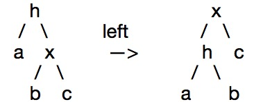
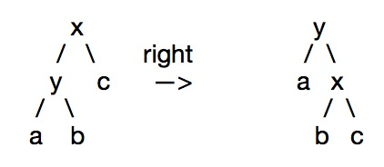

# 数据结构算法

## 红黑树

#### 一、红黑树性质（满足条件）<br>
1. 每个节点不是红色就是黑色 <br>
2. 根节点为黑色 <br>
3. 父子两节点不得同时为红 <br>
4. 任意节点至NULL（树尾端）的任何路径，所含之黑节点必须相同 <br>
5. 每个叶子结点都为黑（树尾端NIL指针或NULL结点）

#### 二、红黑树数据结构定义<br>
	 
```cpp
enum Color  
{  
      RED = 0,  
      BLACK = 1  
};  

struct RBTreeNode  
{  
       struct RBTreeNode*left, *right, *parent;  
       int   key;  
       int data;  
       Color color;  
};
```

#### 三、旋转 <br>
<font face="menlo"> 1.出现红色左或右链接 2.两条连续的红链接 </font><br>
##### 1. 左旋


```cpp
node rotateLeft(node h){
	node x = h->right;
	h->right = x->left;
	x->left = h;
	x->color = h->color;
	h->color = RED;
	x->N = h->N;
	h->N = 1 + size(h->left) + size(h->right);
	return x;
}
```

##### 2. 右旋

```cpp
node rotateRight(node h){
	node x = h->left;
	h->left = x->right;
	x->right = h;
	x->color = h->color;
	h->color = RED;
	x->N = h->N;
	h->N = 1 + size(h->left) + size(h->right);
	return x;
}
```
<hr>
#### 四、插入 <br>   
情况1：被插入的节点是根节点。<br>
处理方法：直接把此节点涂为黑色。 


情况2：被插入的节点的父节点是黑色。 <br>
处理方法：什么也不需要做。节点被插入后，仍然是红黑树。
    
    
情况3：被插入的节点的父节点是红色。 <br>
<font face="menlo">① 叔节点为红 </font><br>
处理方法： 更改父节点为黑，更改叔节点为黑，更改祖父节点为红，把当前节点指向祖父节点

<font face="menlo">② 叔节点为黑，父节点是祖父节点的左孩子，被插入节点为父节点的左孩子 (outside) </font><br>
处理方法：更改父节点为黑，更改祖父节点为红，以祖父节点右旋

<font face="menlo">③ 叔节点为黑，父节点是祖父节点的左孩子，被插入节点为父节点的右孩子（inside） </font><br>
处理方法：更改当前节点为父节点，以当前节点左旋，继续 ② 操作
