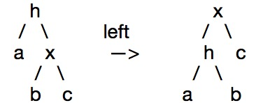

# Data-structure-memo

# 数据结构算法

## 红黑树

#### 一、红黑树性质（满足条件） 
1. 每个节点不是红色就是黑色  
2. 根节点为黑色  
3. 父子两节点不得同时为红  
4. 任意节点至NULL（树尾端）的任何路径，所含之黑节点必须相同  
5. 每个叶子结点都为黑（树尾端NIL指针或NULL结点）

#### 二、红黑树数据结构定义 
	 
	enum Color  
	{  
	      RED = 0,  
	      BLACK = 1  
	};  
	  
	struct RBTreeNode  
	{  
	       struct RBTreeNode*left, *right, *parent;  
	       int   key;  
	       int data;  
	       Color color;  
	};  

#### 三、左旋  
 1.出现红色右链接 2.两条连续的红链接  

#### 四、右旋
