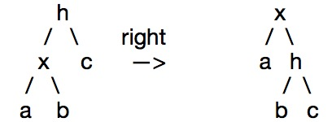

# 数据结构算法

## 红黑树

#### 一、红黑树性质（满足条件） 
1. 每个节点不是红色就是黑色  
2. 根节点为黑色  
3. 父子两节点不得同时为红  
4. 任意节点至NULL（树尾端）的任何路径，所含之黑节点必须相同  
5. 每个叶子结点都为黑（树尾端NIL指针或NULL结点）

#### 二、红黑树数据结构定义 
	 
	<!--lang: java--> 
	enum Color  
	{  
	      RED = 0,  
	      BLACK = 1  
	};  
	  
	struct RBTreeNode  
	{  
	       struct RBTreeNode*left, *right, *parent;  
	       int   key;  
	       int data;  
	       Color color;  
	};  

#### 三、旋转  
 1.出现红色左或右链接 2.两条连续的红链接  
##### 1. 左旋

    node rotateLeft(node h){
        node x = h->right;
        h->right = x->left;
        x->left = h;
        x->color = h->color;
        h->color = RED;
        x->N = h->N;
        h->N = 1 + size(h->left) + size(h->right);
        return x;
    }

##### 2. 右旋

    node rotateRight(node h){
        node x = h->left;
        h->left = x->right;
        x->right = h;
        x->color = h->color;
        h->color = RED;
        x->N = h->N;
        h->N = 1 + size(h->left) + size(h->right);
        return x;
    }
